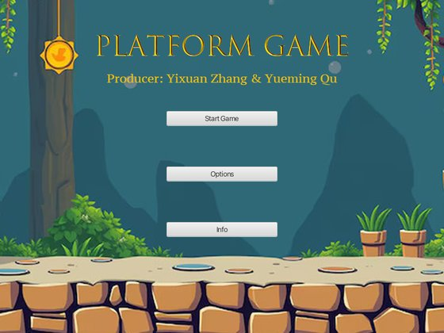
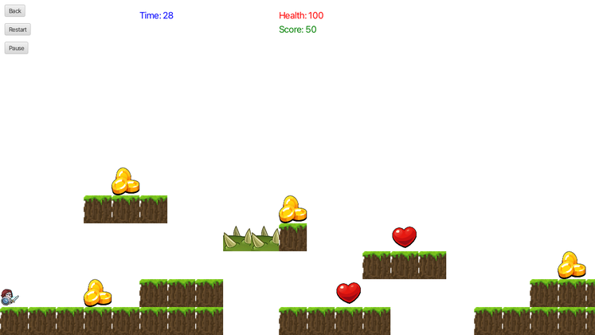
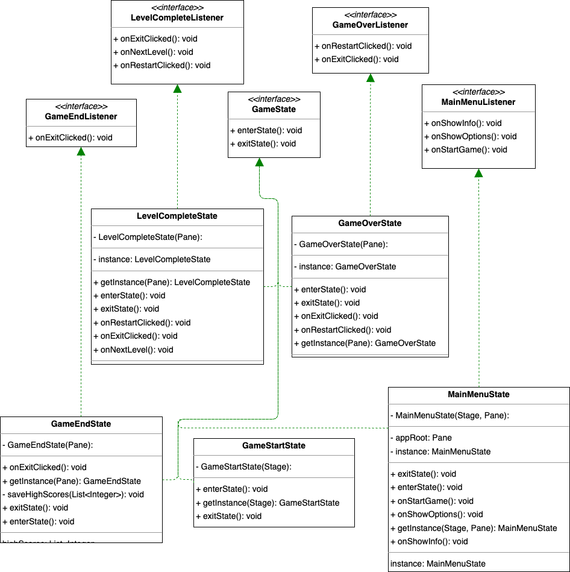

# JavaFX Platformer

[](https://github.com/asher0913/javafx-platformer/actions/workflows/ci.yml)


A two-dimensional platform game built with Java 21 and JavaFX, by Yixuan Zhang and Yueming Qu.
The codebase separates gameplay state, input handling and rendering with MVC, and uses small
behavioural patterns to keep new entities and interactions extensible.

| Main menu | Level 1 |
|---|---|
|  |  |

## Engineering highlights

- MVC architecture with dedicated model, controller, and view packages.
- Command objects for player movement and jump/crouch actions.
- State objects for menu, active game, pause, level-complete, game-over, and
  game-end transitions.
- Factory-based creation for players, monsters, platforms, projectiles,
  collectibles, hazards, and goals.
- Strategy-based collision handling for coins, hearts, spikes, bullets, and
  level goals.
- Three data-driven levels, animated sprites, sound effects, score/health
  tracking, pause/restart controls, and a countdown timer.
- 14 JUnit 5 tests: movement commands, the coin, heart and spike collision rules (a spike hurts
  once, health is capped at 100), the level-complete view, and every level's data (rectangular,
  known tiles only, one player, one goal, something to collect).

## Requirements

- JDK 21
- Maven 3.9+, or the included Maven wrapper

## Run

```bash
./mvnw clean javafx:run
```

## Test

```bash
./mvnw test
```

CI runs the suite under Xvfb on Ubuntu. Adding the level checks found a real bug: one row of
level 2 was a tile short. It is fixed, as is healing above full health (a heart at 100 health
used to give 110).

## Structure

```text
src/main/java/io/github/asher0913/platformer/
├── mvc/controller/          # input, commands, state transitions
├── mvc/model/               # world state, entities, factories, strategies
└── mvc/view/                # JavaFX scenes and reusable UI components
src/main/resources/          # sprites, audio, level data, fonts
src/test/java/               # JUnit regression tests
```

## Controls

- `A` / `D`: move left or right
- `W` / `Space`: jump
- `S`: crouch or move down where supported
- `Esc`: pause or resume

The project keeps game rules separate from JavaFX presentation, so new levels, entities and
collision behaviours can be added without rewriting the main loop. A level is a grid of
characters in `LevelData`: `1` platform, `C` coin, `H` heart, `D` spike, `M` monster, `E`
goal.

## Design

Class diagrams for each pattern are in `src/main/resources/diagrams/`:

- [state](src/main/resources/diagrams/state.drawio.png): menu, playing, level complete, game
  over and game end, each implementing `GameState`;
- [command](src/main/resources/diagrams/command.drawio.png): movement commands;
- [factory](src/main/resources/diagrams/factory.drawio.png): a generic entity factory;
- [strategy](src/main/resources/diagrams/strategy.drawio.png): one collision handler per entity
  type;
- the [controller factory](src/main/resources/diagrams/controllerFactory.drawio.png);
- the [singletons](src/main/resources/diagrams/PlatformerSingletonsDiagram.png).

<details>
<summary>Game states</summary>


</details>
